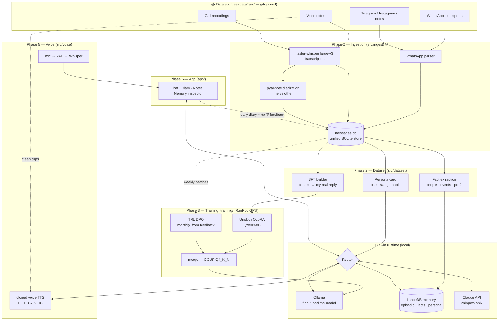
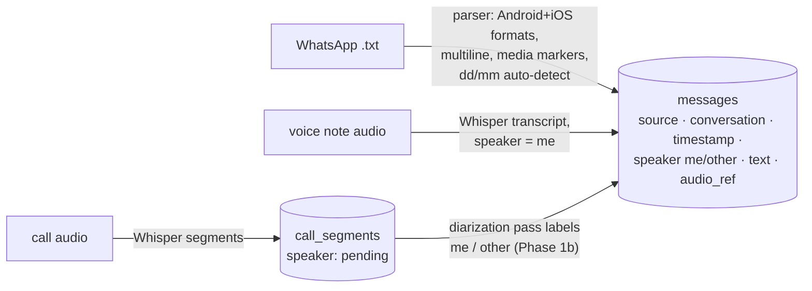
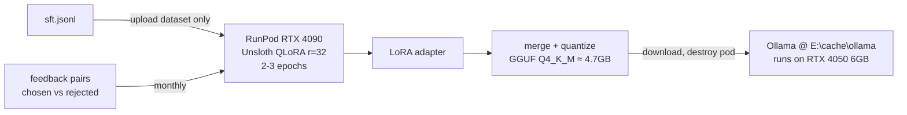
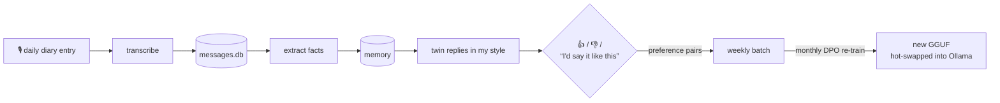

# Pardeep_Self — Personal Digital Twin

A digital twin trained on 3–5 years of my own data — WhatsApp chats, call recordings, voice
notes, journals. It **writes and speaks in my style** (fine-tuned model + cloned voice),
**knows my life** (local memory), and **keeps learning** from a daily voice diary with
feedback-driven re-training.

> **Privacy model — hybrid:** raw data never leaves this PC. Cloud LLM APIs only ever see
> small retrieved snippets. Fine-tuning runs on a rented GPU that is destroyed after each run.

---

## 1. System architecture



---

## 2. Data flow per phase

### Phase 1 — Ingestion ✅ (built)

Everything normalizes into **one SQLite schema** so every later phase reads one store.



- Idempotent: files tracked by sha256 (`ingest_files`), rows deduped by content hash — re-run anytime.
- Clean voice-note clips are set aside as **reference audio for voice cloning**.

### Phase 2 — Dataset construction

| Output         | How                                                                                    | Feeds               |
| -------------- | -------------------------------------------------------------------------------------- | ------------------- |
| `sft.jsonl`  | sliding window: prior turns = context, my real reply = target; loss masked to my turns | QLoRA fine-tune     |
| `persona.md` | LLM pass extracting tone, slang, code-switching, humor, signature phrases              | every system prompt |
| facts table    | people / relationships / events / preferences extraction                               | memory (Phase 4)    |

Filtering: dedupe, drop media-only + 1-word noise, cap per-contact dominance, 5% eval holdout.

### Phase 3 — Training (rented cloud GPU, ~$5–15/run)



### Phase 4 — Memory ("knows my life")

Three memory types in **LanceDB** (embedded, local) with **bge-m3** embeddings (Hinglish-capable):

- **Episodic** — chunked conversations + diary entries, timestamped
- **Semantic** — extracted facts, updated daily
- **Persona** — the persona card, versioned

Retrieval = dense + BM25 + recency decay. Nightly job consolidates: summarize, dedupe facts, refresh persona.

### Phase 5 — Voice twin

```
mic → silero-VAD → faster-whisper (STT) → twin brain → F5-TTS/XTTS cloned voice → speaker
```

Zero-shot clone from my voice-note clips first; fine-tuned GPT-SoVITS if Hinglish quality needs it.

### Phase 6 — App

FastAPI backend + UI (Streamlit → Next.js later). Tabs: **Chat** (text+voice) · **Diary** ·
**Notes** (auto-tagged, searchable) · **Memory inspector** ("what do you know about X?").

The **router** decides per message: casual/style reply → local fine-tuned model; complex
reasoning → Claude API with persona card + retrieved snippets only.

### Phase 7 — Active learning loop (daily)



---

## 3. Storage layout — everything heavy on `E:\cache`

Set once by `scripts/setup_env.ps1` as persistent user env vars:

| Env var                              | Path                               | Holds                                 |
| ------------------------------------ | ---------------------------------- | ------------------------------------- |
| `UV_PROJECT_ENVIRONMENT`           | `E:\cache\venvs\me_too`          | project venv                          |
| `UV_CACHE_DIR` / `PIP_CACHE_DIR` | `E:\cache\uv` / `E:\cache\pip` | package caches                        |
| `UV_PYTHON_INSTALL_DIR`            | `E:\cache\uv-python`             | Python 3.11 itself                    |
| `HF_HOME`                          | `E:\cache\huggingface`           | Whisper, pyannote, bge-m3, TTS models |
| `TORCH_HOME`                       | `E:\cache\torch`                 | torch hub (silero-VAD)                |
| `OLLAMA_MODELS`                    | `E:\cache\ollama`                | twin GGUF models                      |
| `XDG_CACHE_HOME`                   | `E:\cache\xdg`                   | misc tools                            |

Training data stays in `e:\me_too\data\` — **gitignored, never committed, never uploaded**.

## 4. Repo structure

```
me_too/
├── config.yaml            # me_names, whisper model, paths
├── scripts/setup_env.ps1  # one-time: E:\cache dirs + env vars + venv
├── data/                  # GITIGNORED
│   ├── raw/               #   whatsapp/ voice_notes/ calls/ other/  ← drop exports here
│   ├── processed/         #   messages.db, tts_reference/
│   └── datasets/          #   sft.jsonl, dpo.jsonl
├── src/
│   ├── ingest/            # ✅ whatsapp.py · transcribe.py · db.py · run.py (CLI)
│   ├── dataset/           # SFT/DPO builders, persona + fact extraction
│   ├── memory/            # LanceDB store, retrieval, consolidation
│   ├── voice/             # STT loop, TTS clone
│   ├── twin/              # router, persona card, orchestrator
│   └── diary/             # daily diary, feedback capture
├── training/              # Unsloth/RunPod scripts, DPO configs
├── app/                   # FastAPI + UI
└── tests/
```

## 5. Setup & usage

```powershell
# one time — installs Python 3.11, venv, deps; points all caches to E:\cache
powershell -ExecutionPolicy Bypass -File scripts\setup_env.ps1

# 1. tell the parser who you are
#    edit config.yaml → me_names (exact name(s) WhatsApp shows for you)

# 2. drop exports into data\raw\... then ingest (idempotent, re-run anytime)
uv run python -m src.ingest.run whatsapp data\raw\whatsapp
uv run python -m src.ingest.run audio data\raw\voice_notes --kind voice_note
uv run python -m src.ingest.run audio data\raw\calls --kind call

# 3. speaker ID for calls (Phase 1b) — one-time HF setup first:
#    huggingface.co/settings/tokens -> create token -> HF_TOKEN=... in .env
#    + accept terms on BOTH model pages:
#      hf.co/pyannote/speaker-diarization-3.1  and  hf.co/pyannote/segmentation-3.0
uv run python -m src.ingest.run enroll data\raw\voice_notes   # your voice fingerprint + TTS clips
uv run python -m src.ingest.run diarize                        # label calls me/other -> messages

uv run python -m src.ingest.run stats

# tests
uv run pytest -q
```

## 6. Tech stack

| Layer             | Choice                                              | Runs on              |
| ----------------- | --------------------------------------------------- | -------------------- |
| Fine-tune         | Unsloth QLoRA →**Qwen3-8B**                  | RunPod 4090 (rented) |
| Preference tuning | TRL**DPO** (monthly)                          | RunPod               |
| Local serving     | **Ollama**, GGUF Q4_K_M                       | RTX 4050 6GB         |
| Reasoning API     | **Claude** (snippets only)                    | cloud                |
| STT               | **faster-whisper** large-v3 int8 + silero-VAD | local GPU            |
| Diarization       | **pyannote-audio 3.1**                        | local                |
| Voice clone       | **F5-TTS / XTTS-v2** → GPT-SoVITS            | local                |
| Memory            | **LanceDB** + bge-m3 (mem0 under evaluation)  | local                |
| Backend / UI      | **FastAPI** + Streamlit (→ Next.js)          | local                |

## 7. Status

- [X] **Phase 1** — ingestion: WhatsApp parser, Whisper transcription, unified DB, idempotent CLI
- [X] **Phase 1b** — call diarization (pyannote) + speaker ID via voice-note enrollment + TTS reference clips
- [ ] Phase 2 — SFT dataset + persona card + fact extraction
- [ ] Phase 3 — first QLoRA fine-tune → Ollama serving
- [ ] Phase 4 — memory (LanceDB + consolidation)
- [ ] Phase 5 — voice clone + mic loop
- [ ] Phase 6 — FastAPI + UI
- [ ] Phase 7 — daily diary + DPO active learning
