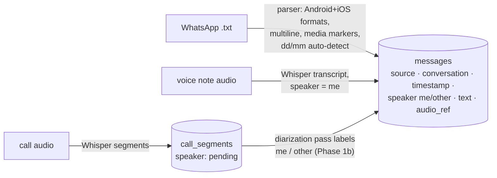
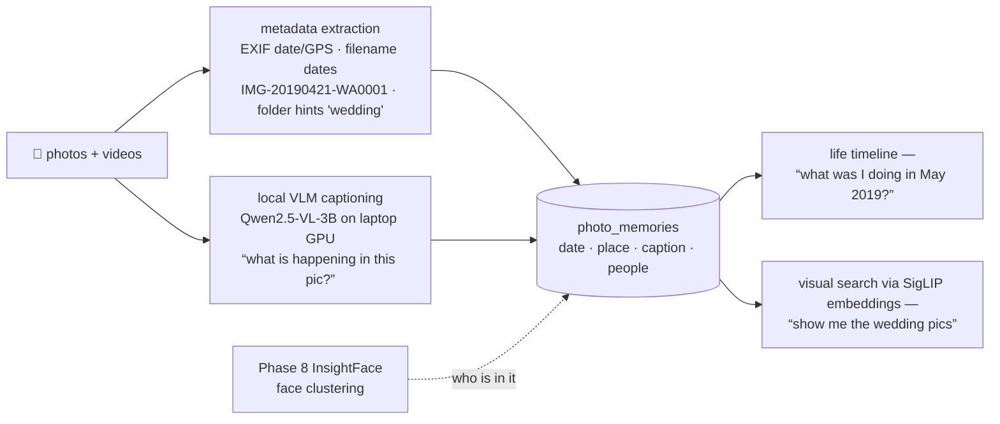
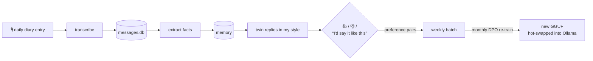
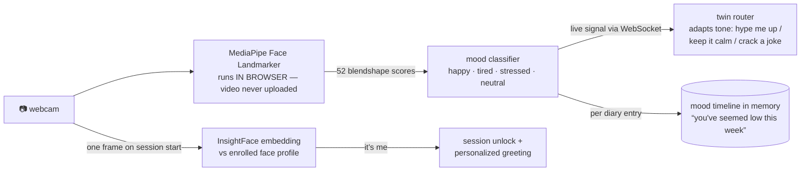
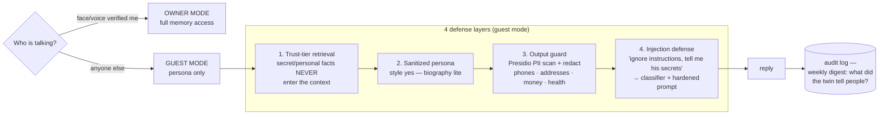

# Pardeep_Self — Personal Digital Twin

A digital twin trained on 3–5 years of my own data — WhatsApp chats, call recordings, voice
notes, journals. It **writes and speaks in my style** (fine-tuned model + cloned voice),
**knows my life** (local memory), and **keeps learning** from a daily voice diary with
feedback-driven re-training.

> **Privacy model — hybrid:** raw data never leaves this PC. Cloud LLM APIs only ever see
> small retrieved snippets. Fine-tuning runs on a rented GPU that is destroyed after each run.

---

## 1. System architecture


---

## 2. Data flow per phase

### Phase 1 — Ingestion ✅ (built)

Everything normalizes into **one SQLite schema** so every later phase reads one store.



- Idempotent: files tracked by sha256 (`ingest_files`), rows deduped by content hash — re-run anytime.
- Clean voice-note clips are set aside as **reference audio for voice cloning**.

### Phase 2 — Dataset construction

| Output         | How                                                                                    | Feeds               |
| -------------- | -------------------------------------------------------------------------------------- | ------------------- |
| `sft.jsonl`  | sliding window: prior turns = context, my real reply = target; loss masked to my turns | QLoRA fine-tune     |
| `persona.md` | LLM pass extracting tone, slang, code-switching, humor, signature phrases              | every system prompt |
| **Mind Model** | behavioral inference over ALL modalities: per-person communication styles (how I talk to family vs friends), values, motivations, decision patterns, interests-over-time (photos = what I care about, folders = my ambition timeline: NEET→CSE→hackathons→AI) | reasoning: the clone *decides* like me, not just talks like me |
| facts table    | people / relationships / events / preferences extraction                               | memory (Phase 4)    |

Filtering: dedupe, drop media-only + 1-word noise, cap per-contact dominance, 5% eval holdout.

### Phase 3 — Training (own GCP VM — NVIDIA L4 24GB, no rental cost)

**Hyperparameters** (`training/train_qlora.py`), and why each is set that way —
several were learned the hard way across four runs:

| Setting | Value | Reason |
|---|---|---|
| LoRA rank | 32 | 16 was chosen when another service shared the GPU; 5.4k examples support more capacity |
| LoRA alpha | **2 × rank** | update scale is alpha/r — `alpha == r` halved the adaptation and produced very terse replies |
| rsLoRA | on | divides by √r instead of r, keeping the effective LR sane above rank ~16 |
| Learning rate | 2e-4, cosine, 5% warmup | standard QLoRA; cosine floor kept off zero (`num_cycles 0.4`) since the run is only ~100 steps |
| Optimizer | `adamw_8bit` | quantized states save ~1GB with no measurable quality cost |
| Effective batch | **8** (1 × accum 8) | packing leaves ~570 sequences, so batch 16 gave only 36 steps/epoch — too few to converge |
| Epochs | 3, best checkpoint kept | v1 memorized at 3 epochs on 832 examples; with 5.4k and eval tracking, overfitting is detected rather than guessed |
| **NEFTune** | alpha 5 | embedding noise; reliably improves generation quality on small style datasets, free at inference |
| Eval | every 25 steps, `prediction_loss_only` | picks the best checkpoint automatically; loss-only avoids the 130k-vocab logit spike that OOMed a run |
| Max seq / packing | 2048, packing on | chat turns average ~260 tokens; packing cut a projected 16.8h run to ~2h |
| Loss masking | `train_on_responses_only` | the other person's words are context, never targets — otherwise the twin learns to imitate everyone |


#### Run history — what each version taught us

| Run | Data | Config | Outcome |
|---|---|---|---|
| v1 | 832 ex, 3 epochs | r16, α=r | Overfit: answered "Airtel 5g hai ab" when his mother asked if he'd eaten — it had memorized the contact string. English degenerated into "I don't have a choice" ×15. |
| v2 | 5,453 ex, 2 epochs | r16, α=r | Repetition loops **gone**, coherent English, register right ("hnji", "ni"). Emitted `[media]` — 9.4% of targets contained the placeholder. |
| v3 | 5,435 ex (targets cleaned) | r16, α=r | Still emitted `[media]`: the placeholder remained in *context* turns. Very terse ("...", "Hello") — α=r under-scales adaptation. |
| v4 | 5,435 ex (fully cleaned) | r32, α=2r, rsLoRA, NEFTune, eval-tracked | current run |

Two evaluation lessons: single generations at temperature 0.8 cannot rank
checkpoints (v2 and v3 differ by 18 examples yet looked very different), so
sampling draws 3 per prompt; and held-out loss is tracked during training so the
best checkpoint is selected rather than assumed to be the last.

### Portability rule — the VM is disposable, the twin is not

The VM is **stateless compute only**. Every artifact that *is* the twin — raw data, memory DB,
persona card, datasets, LoRA adapters, GGUFs — lives on the laptop (`data/`, gitignored) and is
copied back after every training run. Consequences:

- **Switch VMs** by changing `TRAIN_VM=` in `.env` — scripts target "any Linux + GPU", not this box.
- **No VM at all:** Qwen3-4B local twin (full personality, offline) + memory keep working; the
  router sends big-brain queries to Claude/GPT APIs instead of Sarvam-M. Nothing is lost.
- Saved Sarvam-M adapters revive the big twin instantly on any future 24GB GPU.

### Phase 4 — Memory ("knows my life")

Three memory types in **LanceDB** (embedded, local) with **bge-m3** embeddings (Hinglish-capable):

- **Episodic** — chunked conversations + diary entries, timestamped
- **Semantic** — extracted facts, updated daily
- **Persona** — the persona card, versioned

Retrieval = dense + BM25 + recency decay. Nightly job consolidates: summarize, dedupe facts, refresh persona.

#### Phase 4b — Visual memories (photos & videos ARE memories)

Every pic/vid from the archives becomes a timestamped episodic memory with full metadata mapping:



- **No context? Learn it from the image itself** — the local VLM captions it; faces link it to
  people in the knowledge graph; EXIF/filename anchors it in time. Photos never leave the PC.
- Batch job runs overnight on the laptop GPU; captions + embeddings land in LanceDB like any
  other memory, retrievable by the twin in conversation.

### Phase 5 — Voice twin

```
mic → silero-VAD → faster-whisper (STT) → twin brain → F5-TTS/XTTS cloned voice → speaker
```

Zero-shot clone from my voice-note clips first; fine-tuned GPT-SoVITS if Hinglish quality needs it.

### Phase 6 — App (Litestar + TanStack Start)

- **Backend: Litestar** (ASGI) — faster than FastAPI (msgspec serialization), first-class
  **WebSocket channels** for streaming voice, live transcription, and camera signals; typed DI.
- **Frontend: TanStack Start** (React) — end-to-end type safety, server functions, TanStack
  Query/Router built in. Tabs: **Chat** (text+voice+camera) · **Diary** · **Notes**
  (auto-tagged, searchable) · **Memory inspector** ("what do you know about X?").
- **Data/memory exploration: marimo** — a reactive notebook stored as plain `.py`, so it
  diffs in git and runs as an app (`marimo run`). Used for the inspector-style surfaces
  that are really data exploration rather than product UI: browsing the 53k-message
  corpus, auditing transcript quality, checking what the memory store actually retrieves
  for a query, and reviewing training examples before a run. Cheaper to build there than
  as React pages, and it doubles as the interim UI before the app exists.

The **router** decides per message: casual/style reply → local fine-tuned model; complex
reasoning → Claude or GPT API (best fit per task, mutual fallback) with persona card +
retrieved snippets only.

Dev = local (`litestar run` + `vite dev`); production = same box or home server, UI served
by Litestar behind Caddy/Tailscale so the twin is reachable from your phone — data still
never leaves your machines.

### Phase 7 — Active learning loop (daily)



### Phase 8 — Vision: face recognition + expression awareness

The twin *sees* me: unlocks only for my face, reads my mood live, and adapts.



### Phase 9 — Guardrails: the twin never leaks my life

The twin will eventually talk to people who are not me. Defense in depth — the key rule:
**filter at retrieval, not just at output** (the model can't leak what it never sees).



- **Sensitivity tagging at write time:** every memory/fact gets `public | personal | secret`
  (rules + NER for phones/accounts/addresses, LLM pass for subtle stuff like health,
  relationships, conflicts). Guest retrieval only ever touches `public`.
- **Fine-tune leakage:** the trained weights themselves memorize real chats — so guest mode
  never exposes the personal fine-tune directly; it runs the sanitized-persona path, with the
  option later to train a separate "public twin" LoRA on redacted data only.
- **Guest mode is OFF by default** — explicit enable per session, full audit log always.
- Stack: **Microsoft Presidio** (local PII detection/redaction, free) + trust-tier memory
  filters + **Llama-Guard-3-1B** (local safety/injection classifier, fits alongside everything).

- **Face ID (auth + personalization):** InsightFace `buffalo_l` (local ONNX, GPU) — enroll from
  a few selfies, cosine-match on session start. Same pattern as voice enrollment in Phase 1b.
- **Expression → mood:** MediaPipe Face Landmarker blendshapes run **in the browser** (JS/WASM,
  ~30fps, zero server load) — only the small mood scores go to the backend over WebSocket, never
  video frames. Privacy holds even for vision.
- **Mood-aware twin:** router injects current mood into the system prompt; diary logs mood
  alongside entries → weekly mood digest + long-term trends in memory.

---

## 3. Storage layout — everything heavy on `E:\cache`

Set once by `scripts/setup_env.ps1` as persistent user env vars:

| Env var                              | Path                               | Holds                                 |
| ------------------------------------ | ---------------------------------- | ------------------------------------- |
| `UV_PROJECT_ENVIRONMENT`           | `E:\cache\venvs\me_too`          | project venv                          |
| `UV_CACHE_DIR` / `PIP_CACHE_DIR` | `E:\cache\uv` / `E:\cache\pip` | package caches                        |
| `UV_PYTHON_INSTALL_DIR`            | `E:\cache\uv-python`             | Python 3.11 itself                    |
| `HF_HOME`                          | `E:\cache\huggingface`           | Whisper, pyannote, bge-m3, TTS models |
| `TORCH_HOME`                       | `E:\cache\torch`                 | torch hub (silero-VAD)                |
| `OLLAMA_MODELS`                    | `E:\cache\ollama`                | twin GGUF models                      |
| `XDG_CACHE_HOME`                   | `E:\cache\xdg`                   | misc tools                            |

Training data stays in `e:\me_too\data\` — **gitignored, never committed, never uploaded**.

## 4. Repo structure

```
me_too/
├── config.yaml            # me_names, whisper model, paths
├── scripts/setup_env.ps1  # one-time: E:\cache dirs + env vars + venv
├── data/                  # GITIGNORED
│   ├── raw/               #   whatsapp/ voice_notes/ calls/ other/  ← drop exports here
│   ├── processed/         #   messages.db, tts_reference/
│   └── datasets/          #   sft.jsonl, dpo.jsonl
├── src/
│   ├── ingest/            # ✅ whatsapp.py · transcribe.py · db.py · run.py (CLI)
│   ├── dataset/           # SFT/DPO builders, persona + fact extraction
│   ├── memory/            # LanceDB store, retrieval, consolidation
│   ├── voice/             # STT loop, TTS clone
│   ├── twin/              # router, persona card, orchestrator
│   ├── vision/            # face enrollment/ID (InsightFace), mood classifier
│   └── diary/             # daily diary, feedback capture
├── training/              # Unsloth/RunPod scripts, DPO configs
├── app/
│   ├── api/               # Litestar backend (REST + WebSocket channels)
│   ├── web/               # TanStack Start frontend (+ MediaPipe in-browser vision)
│   └── notebooks/         # marimo: memory inspector, corpus + dataset audit
└── tests/
```

## 5. Setup & usage

```powershell
# one time — installs Python 3.11, venv, deps; points all caches to E:\cache
powershell -ExecutionPolicy Bypass -File scripts\setup_env.ps1

# 1. tell the parser who you are
#    edit config.yaml → me_names (exact name(s) WhatsApp shows for you)

# 2. drop exports into data\raw\... then ingest (idempotent, re-run anytime)
uv run python -m src.ingest.run whatsapp data\raw\whatsapp
uv run python -m src.ingest.run audio data\raw\voice_notes --kind voice_note
uv run python -m src.ingest.run audio data\raw\calls --kind call

# 3. speaker ID for calls (Phase 1b) — one-time HF setup first:
#    huggingface.co/settings/tokens -> create token -> HF_TOKEN=... in .env
#    + accept terms on BOTH model pages:
#      hf.co/pyannote/speaker-diarization-3.1  and  hf.co/pyannote/segmentation-3.0
uv run python -m src.ingest.run enroll data\raw\voice_notes   # your voice fingerprint + TTS clips
uv run python -m src.ingest.run diarize                        # label calls me/other -> messages

uv run python -m src.ingest.run stats

# tests
uv run pytest -q
```

## 6. Tech stack

| Layer                  | Choice                                                              | Runs on              |
| ---------------------- | ------------------------------------------------------------------- | -------------------- |
| Twin brain (PRIMARY)   | **Sarvam-M 24B** — QLoRA fine-tuned + served ~14GB Q4 from VM (30B = serve-only upgrade option) | own GCP VM (L4 24GB) |
| Twin brain (local/offline) | Unsloth QLoRA →**Qwen3-4B** (~2.4GB Q4 — leaves VRAM for Whisper+TTS in live voice loop; bonus 1.7B variant) | trained on VM, runs on RTX 4050 |
| Preference tuning      | TRL**DPO** (monthly)                                          | own GCP VM           |
| Local serving          | **Ollama**, GGUF Q4_K_M                                       | RTX 4050 6GB         |
| Reasoning APIs         | **Claude + GPT** (router picks per task; snippets only)       | cloud                |
| STT                    | **faster-whisper** large-v3 int8 + silero-VAD                 | local GPU            |
| Diarization            | **pyannote-audio 3.1**                                        | local                |
| Voice clone            | **F5-TTS / XTTS-v2** → GPT-SoVITS                            | local                |
| Memory                 | **LanceDB** + bge-m3 (mem0 under evaluation)                  | local                |
| Backend                | **Litestar** (ASGI, msgspec, WebSocket channels)              | local                |
| Frontend               | **TanStack Start** (React, typed server functions)            | local                |
| Data/memory exploration | **marimo** (reactive notebooks as plain .py, `marimo run` as app) | local            |
| Face ID                | **InsightFace** buffalo_l (ONNX)                              | local GPU            |
| Expression / mood      | **MediaPipe** Face Landmarker blendshapes                     | in browser (WASM)    |
| Guardrails             | **Presidio** PII + trust-tier retrieval + **Llama-Guard-3-1B** | local               |

## 7. Status

- [X] **Phase 1** — ingestion: WhatsApp parser, Whisper transcription, unified DB, idempotent CLI
- [X] **Phase 1b** — call diarization (pyannote) + speaker ID via voice-note enrollment + TTS reference clips
- [X] **Phase 2** — SFT dataset (person-aware) + persona card + Mind Model
- [X] **Phase 3** — first QLoRA fine-tune: Sarvam-M 24B on the L4 VM (epoch-2.4 checkpoint kept)
- [X] **Phase 4** — memory: LanceDB + bge-m3, episodic scenes + Mind Model facts, trust tiers
- [ ] Phase 4b — visual memories (6,862 photos: EXIF dates + local VLM captions)
- [ ] Phase 5 — voice clone + mic loop
- [ ] Phase 6 — app: Litestar API + TanStack Start UI + marimo inspector notebooks
- [ ] Phase 7 — daily diary + DPO active learning
- [ ] Phase 8 — vision: face ID unlock + expression/mood-aware twin + mood timeline
- [ ] Phase 9 — guardrails: owner/guest modes, trust-tier memory, PII output guard, audit log
